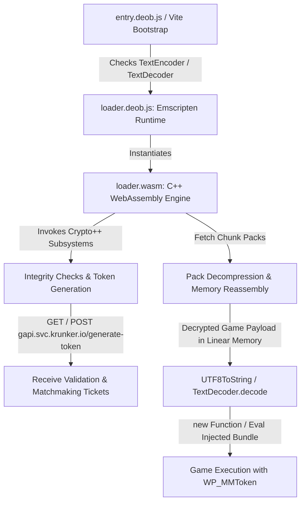

# Complete Krunker WASM Loader Architecture & Reverse Engineering Analysis

This document is an exhaustive reverse engineering breakdown of `loader.wasm`, `loader.deob.js`, and `entry.deob.js` from `bin/loader/`. It details the runtime lifecycle, memory layout, cryptographic operations, anti-tamper mechanisms, asset assembly pipeline, and game execution mechanics.

---

## 1. High-Level Architecture & Execution Flow

---

## 2. Exhaustive Step-by-Step Flow and Order of All Checks

The loader performs a strict sequential verification pipeline from initial HTML document parse through to game execution:

### Step 1: Pre-Execution Environment Checks (`entry.deob.js`)
1. **CSP Nonce Extraction**: Queries `<meta property="csp-nonce">` to validate the CSP context and apply nonces to all dynamic tags.
2. **TextEncoder / TextDecoder Verification**: Checks `typeof TextEncoder !== "undefined" && typeof TextDecoder !== "undefined"`. If missing, execution halts with `"Your browser is not supported."` without loading the WASM bundle.
3. **Dynamic Import Gate**: Imports `../pkg/loader-*.mjs` using `import.meta.url` to preserve module boundary context.

### Step 2: Emscripten Runtime Initialization & Anti-Debugging (`loader.deob.js`)
1. **Console Silencing**: Unless `localStorage.logs` is set, all `console.*` methods (`log`, `warn`, `error`, `info`, `debug`, `trace`) are replaced with empty no-op functions while spoofing their `.toString()`.
2. **WebAssembly Capability Assertion**: Verifies `typeof WebAssembly === "object"`. Throws `"no native wasm support detected"` if absent.
3. **Module Loading**: Loads `loader.wasm` via `WebAssembly.instantiateStreaming` (falling back to arrayBuffer fetch).

### Step 3: WASM Engine Initialization & Cryptographic Seeding (`loader.wasm:U`, `func 175`)
1. **Crypto++ Table Initialization**: Populates internal HMAC, SHA-384, and AES algorithm registries and lookup tables.
2. **Memory Map Setup**: Allocates runtime scratch buffers and establishes stack bounds.

### Step 4: Security & Environment Integrity Checks (`loader.wasm:W`, `func 49`)
1. **Automation & WebDriver Inspection**: Inspects `navigator.webdriver`, looking for automation flags and testing harnesses.
2. **Frame Hierarchy Validation**: Asserts `window.top === window` (or authorized iframe nesting) to detect clickjacking or external wrapper containment.
3. **DOM Integrity Assertion**: Calls imported trampoline functions (`lookup table 153812`, `153921`, `153957` in `loader.deob.js`) to delete/lock down `document.getElementById` and `Element.prototype.appendChild` during sensitive decryption steps.

### Step 5: Network Ticket & Antihack Token Acquisition (`_`, `func 358`)
1. **Endpoint Resolution**: Connects to `https://gapi.svc.krunker.io/generate-token` (with fallback to `https://gapi.beta.krunker.io`).
2. **Signature Generation**: Generates an HMAC-SHA384 challenge signature based on client timing, user agent characteristics, and internal WASM state.
3. **Token Retrieval**: Obtains the encrypted matchmaking validation token (`WP_MMToken`) and chunk pack decryption keys.

### Step 6: Core Pack Fetching & Memory Reassembly
1. **IndexedDB Cache Query**: Queries IndexedDB database store `FILES` for cached chunk blocks (`pkg/core-*.pack` or binary slices). If found and hash matches, reads directly from disk; otherwise issues XHR/Fetch.
2. **Stream Decryption & Inflate**: Decrypts chunks using AES-CTR streams and inflates them into WebAssembly linear memory (`T`, `memory 0`).
3. **Source Materialization**: Reassembles the single $\approx 8.67\text{ MB}$ JavaScript source bundle in linear memory.

### Step 7: Bundle Compilation & Invocation
1. **String Conversion**: Calls `TextDecoder.prototype.decode` on the decrypted linear memory slice (`UTF8ToString`).
2. **Execution**: Compiles and executes the bundle as a new Function, passing the decrypted `WP_MMToken` in `arguments[0]`.

---

## 3. WebAssembly Module Structure (`loader.wasm`)

### 3.1 Module Sections
- **Arch**: 32-bit (`wasm32-unknown-emscripten`)
- **Total Functions**: 548
- **Segments**:
  - `header`, `type` (types 0–45), `import` (45 functions), `function`, `table` (size 786), `memory` (initial 256 pages / 16MB), `global`, `export` (12 exports), `elem`, `code`, `data` (43 data segments), `extern`.

### 3.2 Exports
| Export | Internal Target | Type | Description |
|---|---|---|---|
| `T` | `memory 0` | Memory | WebAssembly linear memory |
| `V` | `table 0` | Table | Function pointer table for `dynCall` |
| `U` | `func 175` | Function | Crypto++ initialization and seed |
| `W` | `func 49` | Function | Main orchestrator / payload unpacker |
| `X` | `func 45` | Function | String decompression / dictionary decoder |
| `Y` | `func 233` | Function | Memory / stack allocation helper |
| `Z` | `func 232` | Function | Stack pointer query / save |
| `_` | `func 358` | Function | Token decryptor |
| `$` | `func 349` | Function | Hash validator |
| `aa` | `func 210` | Function | Dynamic dispatch |
| `ba`–`ea` | `funcs 313–309` | Functions | Crypto primitives (HMAC-SHA384, AES, Zlib) |

